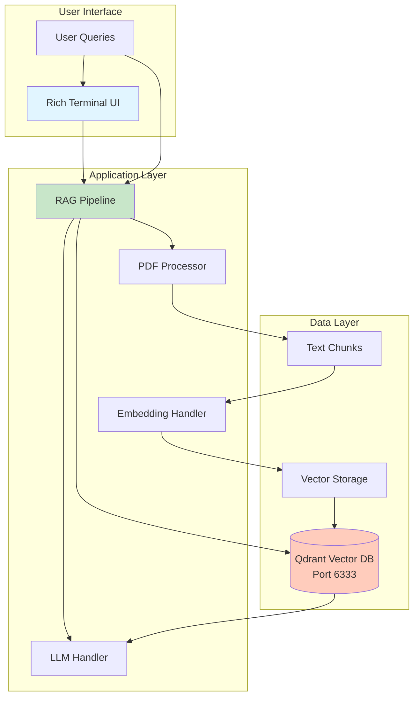
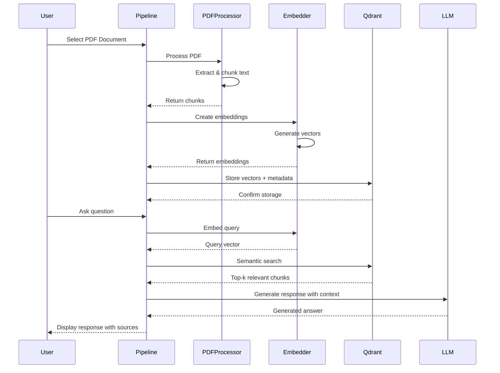
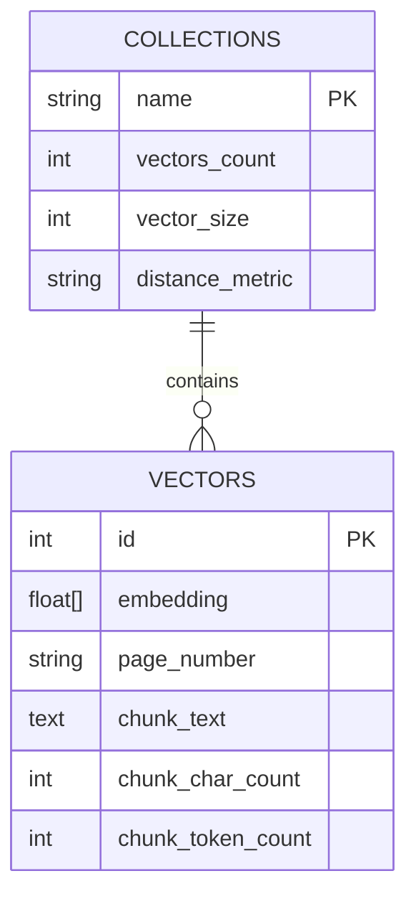
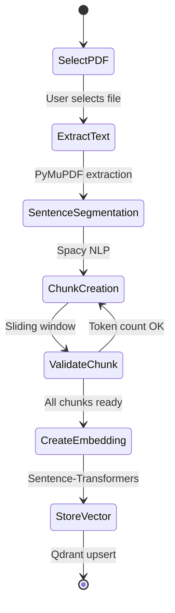
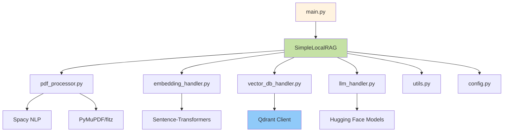
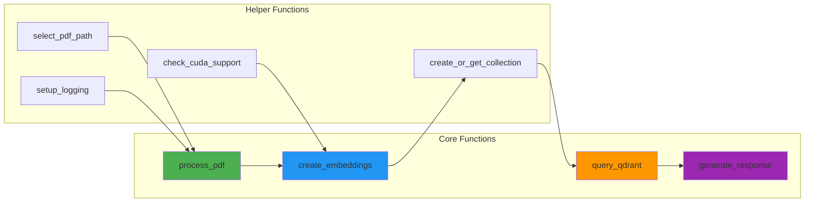

# 🔗 Vector Database RAG - Project Blog

## Problem Statement

As a student constantly working with research papers, textbooks, and documentation—I found myself overwhelmed by the amount of information to process and remember. Traditional search methods weren't cutting it for semantic understanding. I needed a solution that was:
- **Intelligent**: Understand meaning, not just keywords
- **Fast**: Retrieve relevant information instantly
- **Private**: Run entirely locally without sending data to external APIs
- **Scalable**: Handle large documents efficiently

This project became my exploration into building a production-ready RAG (Retrieval-Augmented Generation) system from scratch.

---

## Tech Stack

I wanted to explore modern AI/ML technologies while building something practical:

### Backend
- **Python 3.10+**: Core programming language
- **Qdrant**: High-performance vector database for semantic search
- **Docker**: Containerized database for easy setup and deployment

### AI/ML Stack
- **Sentence-Transformers**: Creating high-quality text embeddings (`all-mpnet-base-v2`)
- **Hugging Face Transformers**: Accessing state-of-the-art language models
- **PyTorch**: Deep learning framework with GPU acceleration support
- **Spacy**: Advanced natural language processing for text chunking

### Document Processing
- **PyMuPDF (fitz)**: Efficient PDF text extraction
- **Rich**: Beautiful terminal UI and progress tracking

### Why Local-First Architecture?
- **Privacy**: All data processing happens on your machine
- **Cost**: No API fees for embeddings or LLM inference
- **Control**: Full control over model selection and parameters
- **Learning**: Understand every component of the system

---

## High Level Design



### System Flow



---

## Low Level Design

### Database Schema



### Document Processing Flow



### Component Architecture



### API/Module Interactions



---

## Challenges Faced and Overcome

### 1. **First Time with Vector Databases**
**Challenge**: Coming from traditional SQL databases, I struggled with:
- Understanding vector similarity search
- Choosing appropriate distance metrics (cosine vs. euclidean)
- Optimizing embedding dimensions

**Solution**:
- Read Qdrant's documentation thoroughly
- Experimented with different embedding models
- Used cosine similarity for normalized semantic search
- Visualized token distributions to optimize chunk sizes

### 2. **Qdrant Docker Connection Issues**
**Challenge**: Application couldn't connect to Qdrant running in Docker container.

**Error**:
```
ConnectionError: Cannot connect to Qdrant at localhost:6333
```

**Solution**:
- Properly exposed port 6333 in Docker run command
- Increased timeout settings in QdrantClient initialization
- Ensured Docker container was running before application start
- Used volume mounts for data persistence

### 3. **Text Chunking Strategy**
**Challenge**: Fixed-size chunks often split sentences mid-thought, losing semantic coherence.

**Solution**:
- Implemented sliding window chunking with overlap
- Used Spacy for sentence-level segmentation
- Set optimal chunk size: 256 tokens with 30 token overlap
- Visualized token distributions to validate approach

### 4. **GPU Memory Management**
**Challenge**: Large language models exceeded available GPU memory (8GB).

**Solution**:
- Implemented 4-bit quantization using bitsandbytes
- Selected smaller but efficient models (Gemma-2B)
- Added automatic fallback to CPU if GPU unavailable
- Monitored memory usage with PyTorch profiling

### 5. **Embedding Model Selection**
**Challenge**: Needed balance between quality and speed.

**Solution**:
- Benchmarked multiple models: `all-MiniLM-L6-v2`, `all-mpnet-base-v2`
- Chose `all-mpnet-base-v2` for best quality (768 dimensions)
- Implemented batch processing to speed up embedding creation
- Added progress bars for user feedback

### 6. **Context Window Limitations**
**Challenge**: Retrieved chunks exceeded LLM context window, causing truncation.

**Solution**:
- Limited context to 6000 characters
- Implemented smart truncation prioritizing top-scored chunks
- Added token counting before LLM inference
- Designed prompts to work within constraints

### 7. **PDF Extraction Quality**
**Challenge**: Some PDFs had garbled text, tables, or image artifacts.

**Solution**:
- Used PyMuPDF for robust text extraction
- Filtered out low-quality text blocks
- Removed excessive whitespace and special characters
- Added page offset configuration for documents with cover pages

---

## Key Learnings

1. **Vector Embeddings**: Understanding that semantic search is fundamentally different from keyword search—embeddings capture meaning, not just word matches
2. **Chunking Strategy**: Proper text segmentation is critical—too large and you lose precision, too small and you lose context
3. **GPU Utilization**: PyTorch's CUDA support dramatically speeds up both embedding and inference—10x faster than CPU
4. **Model Selection**: Smaller quantized models can provide 80% of the quality at 20% of the memory cost
5. **Docker Compose**: Simplified local development—one command to start the entire stack
6. **Progress Feedback**: Rich library made the terminal experience professional and informative

---

## Future Enhancements

- [ ] Multi-document support (process and query multiple PDFs simultaneously)
- [ ] Web interface using Gradio or Streamlit
- [ ] Support for additional document formats (DOCX, TXT, HTML, Markdown)
- [ ] Hybrid search combining vector similarity and keyword matching
- [ ] Caching mechanism for frequently accessed embeddings
- [ ] Fine-tuning embedding models on domain-specific data
- [ ] Export conversations and sources to PDF reports
- [ ] API endpoint for integration with other applications
- [ ] Real-time document monitoring and automatic re-indexing
- [ ] Multi-language support for non-English documents

---

## Conclusion

This project pushed me deep into the world of modern AI/ML systems. Working with vector databases taught me how semantic search works under the hood, and implementing RAG from scratch gave me insights that using pre-built solutions never would.

The biggest takeaway? **Understanding your data is crucial**—90% of RAG quality comes from proper document processing, chunking, and retrieval strategy. The LLM is just the final step.

If you're building something similar, start with good chunking logic, experiment with different embedding models, and always visualize your data before scaling up. Test each component thoroughly before moving on.

---

## Resources

- **Code Repository**: [GitHub Link](https://github.com/Voodels/PrivateRagFromScratch)
- **Qdrant Docs**: https://qdrant.tech/documentation/
- **Sentence-Transformers**: https://www.sbert.net/
- **Hugging Face**: https://huggingface.co/
- **PyMuPDF**: https://pymupdf.readthedocs.io/

---

*Built with ❤️ by Vighnesh*
