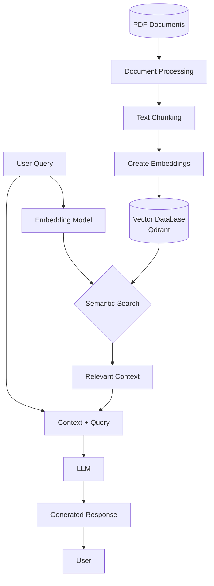

# Vector Database RAG: Local Retrieval-Augmented Generation System


## 📚 What is RAG (Retrieval-Augmented Generation)?

RAG combines the strengths of **retrieval-based** and **generation-based** approaches in AI systems to produce more accurate, relevant, and informative responses.

### How RAG Works:

1. **Retrieval**: When a question is asked, the system retrieves relevant information from a knowledge base
2. **Augmentation**: The retrieved information is used to "augment" or enhance the context provided to the language model
3. **Generation**: The language model generates a response based on both the question and the retrieved context

This approach allows AI systems to:
- Access up-to-date information not in their training data
- Provide more factually accurate answers
- Cite specific sources for information
- Avoid "hallucinations" (making up information)

## 🚀 Use Cases for RAG Systems

- **Enterprise Knowledge Bases**: Query internal documents, manuals, reports
- **Customer Support**: Answer questions based on support documentation
- **Medical Information Systems**: Provide information from medical literature
- **Legal Research**: Analyze and reference relevant case law and statutes
- **Educational Tools**: Answer questions using textbooks and learning materials
- **Personal Knowledge Management**: Query your own notes and documents

## 🏗️ System Architecture



> **Note**: For an interactive view of this diagram, open `mermaid_diagram.html` in your browser.

## 💻 Technologies Used

- **Qdrant**: Vector database for efficient similarity search
- **PyMuPDF (fitz)**: PDF processing and text extraction
- **Sentence-Transformers**: Creating text embeddings
- **Hugging Face Transformers**: Accessing state-of-the-art language models
- **Rich**: Terminal formatting and user interface
- **Pandas & Matplotlib**: Data handling and visualization
- **Spacy**: Natural language processing
- **PyTorch**: Deep learning and model management

## 🛠️ Setting Up Qdrant

To run Qdrant in a Docker container, use the following command:
```bash
docker run -p 6333:6333 -v $(pwd)/qdrant_storage:/qdrant/storage qdrant/qdrant
```
This command maps the local directory `qdrant_storage` to the Qdrant storage directory inside the container, allowing you to persist data across container restarts.

## 📋 How This Project Works

### 1. PDF Processing
- The system scans for PDF files in the current directory and subdirectories
- User selects a PDF document to process
- Document is processed page by page, with images and irrelevant content filtered out
- Text is cleaned and formatted for further processing

### 2. Text Chunking
- Text is divided into semantic chunks of manageable size
- Chunks maintain context while staying within token limits for embedding models
- Overlapping chunks ensure concepts that cross chunk boundaries aren't lost
- Token counts are visualized to help optimize chunking parameters

### 3. Embedding Creation
- Each text chunk is transformed into a high-dimensional vector using Sentence-Transformers
- These embeddings capture the semantic meaning of the text
- Similar concepts have similar vector representations, enabling semantic search

### 4. Vector Database Storage
- Embeddings are stored in Qdrant, a vector database optimized for similarity search
- Text chunks are stored alongside their embeddings as payloads
- Collections are created per document for organized storage

### 5. Query Processing
- User questions are embedded using the same model used for document embedding
- Vector similarity search identifies the most relevant text chunks
- Top matching chunks are retrieved along with their relevance scores

### 6. Response Generation
- Retrieved context is combined with the original query
- A language model generates a comprehensive answer based on this information
- Responses are presented with citation information (relevance scores and page numbers)

## 🚀 Getting Started

### Prerequisites
- Python 3.10+
- Docker (for running Qdrant)

### Installation

1. Clone this repository:
```bash
git clone https://github.com/yourusername/vector-database-rag.git
cd vector-database-rag
```

2. Create a virtual environment:
```bash
python -m venv venv
source venv/bin/activate  # On Windows: venv\Scripts\activate
```

3. Install dependencies:
```bash
pip install -r requirements.txt
```

4. Start Qdrant:
```bash
docker run -p 6333:6333 -v $(pwd)/qdrant_storage:/qdrant/storage qdrant/qdrant
```

5. Run the application:
```bash
python main.py
```

## 📊 Project Structure

```
VectorDB-model/
├── main.py                      # Entry point for the application
├── requirements.txt             # Python dependencies
├── simple_local_rag.log         # Log file for application events
├── token_distribution.png       # Visualization of token counts across chunks
├── qdrant_storage/              # Persistent storage for vector database
└── simple_rag/                  # Core application code
    ├── __init__.py
    ├── config.py                # Configuration settings
    ├── embedding_handler.py     # Embedding creation and management
    ├── llm_handler.py           # Language model interaction
    ├── pdf_processor.py         # PDF extraction and text processing
    ├── pipeline.py              # Main application workflow
    ├── utils.py                 # Utility functions
    └── vector_db_handler.py     # Qdrant database interaction
```

## 📝 Configuration

The system is highly configurable through the `config.py` file:

- **PDF Processing**: Adjust page offset for skipping front matter
- **Chunking**: Modify chunk size and overlap for optimal retrieval
- **Embedding Model**: Change the embedding model for different languages or domains
- **LLM Settings**: Configure different language models based on hardware capabilities
- **Qdrant Settings**: Adjust connection parameters for the vector database

## 🔍 Advanced Features

- **Persistent Storage**: Document embeddings are stored for future use
- **Collection Management**: Creates separate collections for each document
- **Hardware Adaptation**: Detects and utilizes GPU acceleration when available
- **Visualization**: Provides insights into chunk sizes and token distribution
- **Interactive UI**: Rich terminal interface for easy interaction

## 📈 Performance Considerations

- **Embedding Model Selection**: Balances quality vs. speed/resources
- **Chunk Size Optimization**: Affects retrieval quality and processing speed
- **GPU Acceleration**: Significantly improves embedding and inference speed
- **Collection Size**: Performance scales with document size and complexity

## 🔧 Troubleshooting

- **Missing Dependencies**: Run `pip install -r requirements.txt` to ensure all packages are installed
- **CUDA Issues**: If GPU acceleration isn't detected, check your PyTorch installation
- **Qdrant Connection**: Ensure the Docker container is running before starting the application
- **Memory Errors**: Reduce model size or chunk processing batch size for lower-memory systems

## 📄 License

This project is licensed under the MIT License - see the LICENSE file for details.

## 🙏 Acknowledgments

- Sentence-Transformers for embedding models
- Hugging Face for transformer models
- Qdrant team for the vector database
- PyMuPDF developers for PDF processing capabilities

